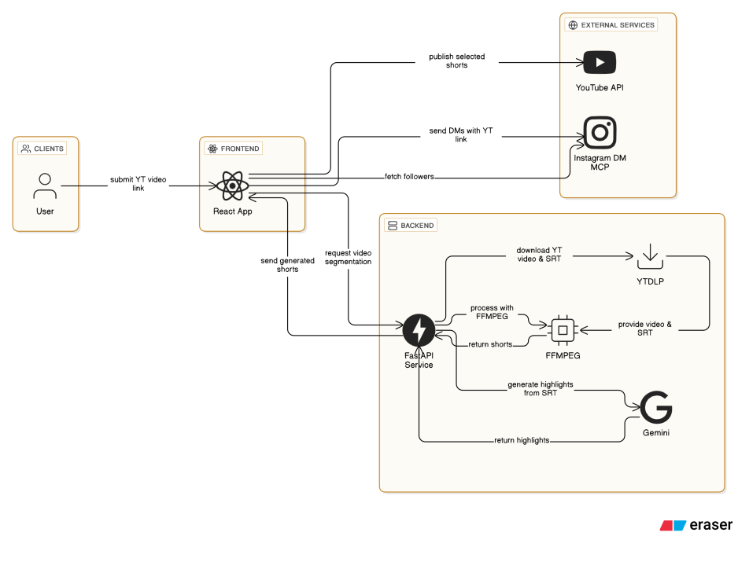

# brainrot-reel-generator

This is an end-to-end brainrot video generation pipeline which does targeted campaigns on Instagram using the [Instagram DM MCP](https://github.com/trypeggy/instagram_dm_mcp) server.

Its purpose is to create short form content (reels, YT shorts) from long form content with a gameplay below (which is the popular trend). It finds key highlights (mic-drop moments, controversial statements) from the long video to convert into short form content, ranging from 10s to a minute.

It exposes this functionaliy via a FastAPI server which can be used from the beautiful React frontend.

Once the video is generated, it can be uploaded on Youtube Shorts and shared to followers for campaigning using the Instagram DM MCP server.

Example generated short: https://www.youtube.com/shorts/U6531MvLILY

### Architecture



### Setup development environment

##### Instagram DM MCP server

- Clone this [repo](https://github.com/trypeggy/instagram_dm_mcp) and follow their setup instructions.

- The FastAPI server expects the MCP server to run in SSE transport instead of STDIO at port 8000. Edit the `src/mcp_server.py` file in the `instagram_dm_mcp` folder with following content:

	```py
	mcp.run(transport="sse")
	```

	You'll find this line at the very end of the file.

	Run the MCP server:
	```
	python src/mcp_server.py
	```

##### FastAPI server

For running the backend server, you need:

- ffmpeg installed.

- `.env` file: 
	```
	GEMINI_API_KEY=
	INSTAGRAM_USERNAME=
	```

- `cookies.txt` from a browser, ideally firefox on windows. obtain them using this command (can be skipped for the first few runs): 
	```
	yt-dlp --cookies-from-browser firefox --cookies cookies.txt
	```

- `client_secrets.json` from Google Cloud Console, create project > enable youtube data API v3 > OAuth Consent screen > create OAuth Client for desktop > download JSON credentials.

- create a virtual environment and activate it

	```
	python -m venv venv
	```

	follow your shell activation command.

- dependencies
	```
	poetry install
	```

- run the server
	```
	fastapi dev ./app.py --port 8001
	```

##### React frontend

In the `frontend/` folder:

- `pnpm i`
- `pnpm dev`